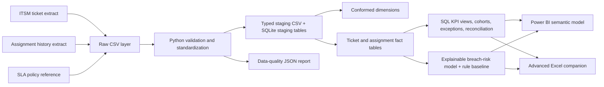

# Architecture and data flow

The ticket fact grain is one ticket; the assignment fact grain is one ownership event. Surrogate integer keys support durable joins while source `ticket_id` remains the business key. Raw inputs are preserved and only staging, curated, and database outputs are rebuilt.
